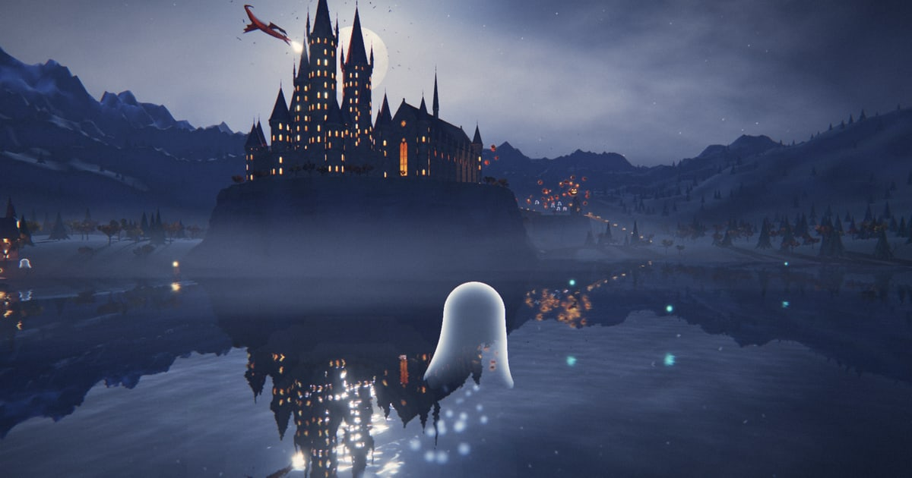

# Hollowmere



You are a ghost drifting through a haunted castle on a cliff above a moonlit lake. It opens on autofly, a slow flight along a route through the best views; take over at any time, fly through walls, and let go to drift back onto the lantern route. It's a mood piece for Halloween night, with no goals and nothing to lose: leave it running on a second screen and come back to fly through the great hall.

**[Fly it](https://victor-eu.github.io/hollowmere/)** in a recent Chrome, Edge, Firefox or Safari, on a computer or a phone. Turn the sound on.

## Flying

| | Keyboard and mouse | Touch |
|---|---|---|
| Look around | Drag | Drag on the right side |
| Drift where you look | W A S D or the arrow keys | The left stick, which appears where you press |
| Rise and sink | Space or E, Q or C | ▲ ▼ |
| Glide faster | Shift | |
| Camera closer or farther | Wheel | Pinch |
| Autofly on or off | F | Autofly |
| Sound on or off | M | Sound |
| The list of controls | H, and Esc to close it | Controls |

Autofly takes over again 12 seconds after you let go. Links can start you somewhere: `?at=hall` (or `lake`, `viaduct`, `gate`, `keep`), and `?autofly=0` starts in free flight.

## The place

The family who built the castle on the cliff kept a lamp in every window, so the boats on the Mere could find the shore at night, and when the last of them died the lamps went on burning anyway. The Hollow Hall is lit by a hundred and fifty candles nobody lights, and on All Hallows' Eve the castle's dead and their guests sit down to a feast there, under a host who carries his head. The Lantern Warden, roots and iron with a lantern for a head, stands at the Warden's Gate and turns to watch whatever drifts up the Candle Stair. Something with wings has made its roost on Wyrmspire, the highest tower, and breathes fire over the keep when it circles. The ghosts who wander the grounds don't remember who they were. Neither do you.

## Accessibility

- **Keyboard.** Everything works from the keyboard. Tab reaches the scene and every button, each with a visible focus ring; H opens the list of controls and Esc closes it. The touch screen's ▲ ▼ buttons can be held from a keyboard too.
- **Screen readers.** The scene describes what autofly does and which keys fly, and a polite live region announces taking over, autofly coming back, and each named place (the pill's per-second countdown is left out, and a status has to settle for a second first, so passing through thin walls stays quiet). Sound never starts until you ask for it.
- **Reduced motion.** With `prefers-reduced-motion`, the ghost doesn't bob, there's no film grain, the mist stops drifting, the effect of passing through stone is softer, and autofly turns more gently.
- **Contrast.** The HUD's text holds 4.5:1 (3:1 for the big title) against whatever is drawn behind it, measured at twelve points round the route on a desktop and a phone. With `prefers-contrast: more` the glass goes solid and the secondary text brighter; Windows high-contrast mode keeps the pressed-button lamps.
- **Flashing.** Nothing flickers faster than about 2 Hz: the lights at up to 1.6 Hz, the candles and the dragon's fire at 2.1 Hz, the pumpkins at 2.3 Hz. Measured from the frames, the most anything flashes is 2.5 times a second over a quarter of a 10° field of view, as autofly passes through the great hall's glass wall, against WCAG's limit of 3.
- **Touch.** Buttons are at least 44 px on touch screens.

It is a visual piece first: beyond the description and the place names, the world itself has no text equivalent. `npm run a11y` checks all of the above (see [Running it](#running-it)).

## Running it

You need Node 24 and, for the checks and screenshots, Google Chrome.

```bash
npm install
npm run dev
```

The design is in [docs/design.md](docs/design.md); the original single-file block-out is in [docs/mockup/](docs/mockup/hollowmere-mockup.html).

| Script | What it does |
|---|---|
| `npm run dev` | Dev server with hot reload |
| `npm run build` | Typecheck, then a static build in `dist/` (relative paths, deployable anywhere) |
| `npm run typecheck` | `tsc` over `src/` and `tools/` |
| `npm run validate [-- <devUrl>] [--strict] [--quality=<tier>]` | Checks the data files and every geometry in headless Chrome, flies the route and measures draw calls and triangles against the budgets, then turns sound on and checks every music stem decodes and plays. Starts its own dev server unless given a URL. Runs on the high tier unless told otherwise. Exits 1 on errors; `--strict` also fails on warnings and budget overruns |
| `npm run loadtime [-- <url>] [--profile=desktop,phone] [--runs=3]` | Builds the site, serves it as a static host would, and times cold visits behind a throttled network (and, for the phone, a 4× slower CPU) until the first frame; see [Loading and quality](#loading-and-quality). Exits 1 over budget |
| `npm run a11y [-- <url>] [--skip=<check>,...] [--seconds=20]` | Builds the site and checks it in headless Chrome against design doc §14: axe-core's WCAG 2.2 AA rules (as loaded, with the controls open, on a phone, and without WebGL), Tab order and focus rings and the keys, what the live region says, reduced motion, the HUD's text contrast against the rendered scene round the route, and flashes counted from the frames at each named point, after a 5 Hz strobe as a control. Exits 1 on any failure |
| `npm run shots -- <url> <outDir> [--mockup[=url]] [--views] [--clean] [--quality=<tier>]` | Screenshots of six fixed route points in headless Chrome; with `--mockup`, the same points from the mockup for side-by-side checks. With `--views` (dev server only), seven fixed free-camera views of the castle instead, steadier for judging materials and geometry. `--clean` hides the HUD. The tier is pinned, high by default |
| `npm run compare -- <reference> <screenshot> [out.png]` | A screenshot beside a reference painting, each over its palette, plus the numbers the look targets talk about; see [The look](#the-look) |
| `npm run process [-- <id>...] [--force]` | Builds the textures the app ships (`public/assets/`) from `prompts/*.yaml`; see [Textures](#textures) |
| `npm run generate -- <id> [--n=4] [--dry-run]` | Asks OpenAI's image API for texture candidates (needs `OPENAI_API_KEY`; billed to that key) |
| `npm run stems [-- <id>...] [--force] [--report=<dir>]` | Renders the music stems (`public/assets/audio/`) from the score, or from a composer's masters in `music/`; see [Sound](#sound) |

The headless tools use the installed Google Chrome; set `CHROME` to its path if it lives elsewhere, and `ANGLE` to pick the GPU backend (`metal` on macOS by default, `swiftshader` elsewhere).

URL parameters: `?at=hall` (or `lake`, `viaduct`, `gate`, `keep`) starts at a named route point, `?autofly=0` starts in free flight, `?quality=high` (or `medium`, `low`) pins a quality tier, `?stats` shows the stats overlay (also in production builds, for checking performance on phones).

## Dev tools

In `npm run dev` only:

| Key | What it does |
|---|---|
| `` ` `` | Stats overlay: fps, CPU and GPU frame time, draw calls and triangles against the budgets (300 and 1.5M), memory, the quality tier, resolution and what last changed them, texture bytes streamed, where the ghost is and what autofly is doing |
| `V` | Free camera. Same keys and drag as flying; the wheel sets its speed, Shift is 5×. The ghost keeps flying on its own. The camera's pose survives reloads, so it stays put while you edit code |
| `L` | Look panel: sliders and colour pickers for everything in `data/look.json`, applied live; `⌘S` saves back to the file |
| `R` | Route editor (opens the free camera). Click a handle to select it, drag the gizmo to move it, edit speed, names and pass-through legs in the panel. `[` `]` step through waypoints, `I` inserts, `Delete` removes, `J` flies the route from the selected point, `⌘Z` / `⇧⌘Z` undo and redo, `⌘S` saves to `data/route.json` without reloading |
| `T` / `.` | Pause the world / step one frame |
| `G` | Drop the ghost in front of the free camera and fly it from there |
| `K` | Re-run every check and print the results to the console |

The route line is coloured by speed. It turns red where it dips under the ghost's 1.8 m ground clearance (the ghost would float up off the route) and violet where it passes through stone on a leg that isn't listed in `through`.

The route check also makes sure autofly enters and leaves the great hall through its windows rather than the stone between them, since flying in through the glass is the signature moment.

Geometry checks run before the first frame and then every half second over whatever changed: NaN or Infinity in any attribute, instance matrix, transform or uniform; zero-length normals on lit meshes (normalising zero gives NaN on the GPU); indices past the end; attributes shorter than the positions. Problems go to the console, and a red badge appears top right while the overlay is closed.

## The look

How the world looks lives in `data/look.json`, apart from where things are: the grade (exposure, contrast, split tone, the lifted black, vignette, grain), bloom, the emissive levels, moonlight, the hemisphere and the cold fill from the far side, the sky's colours, fog, the lake and the mist. Tune it in a dev build with the look panel (`L`) while looking at the result, and save from there. The emissive levels and bloom were tuned together: change them only while looking (design doc §8).

The scene draws in two goes (`src/render/post.ts`): everything that writes depth, then, with that depth in a texture, the see-through things. That lets the mist fade softly wherever it meets water, rock or wall, so a bank can sit right on the lake. The lake is a planar reflection bent by scrolling ripple normals, with fresnel and the moon's glitter path.

The mood-board paintings (design doc §3a) are references only and stay out of the repo. Put them in `reference/`, which is gitignored, and check a view against one:

```bash
npm run shots -- http://localhost:5173 shots --clean
npm run compare -- reference/painting-a.png shots/lake-port.png
```

It writes `shots/lake-port-compare.png` and prints, for both images, the brightness spread, how much is near black, how much is warm light, and the colour of the sky, the shadows and the highlights. Take a quality, never a composition: compare palette and light, not layout.

## Life

Everything that moves on its own is in `src/life/`; where it lives is in `data/world.json` under `life`. The creature bible is design doc §10. Each creature has a small, local reaction to you that never stops or follows you.

- **The wyrm** is one skinned mesh: an iron-dark hide with ember-red in the seams between scales, a hinged jaw, and bat wings with shoulder, elbow, wrist and finger bones that flap in bouts between glides. Its spine bones are laid along a loop round the keep every frame, so the body flows through the turns. It breathes fire along its path every 8–13 s. Hover above about 130 m near the keep and the next pass leans up to 20 m toward you (never nearer than 15 m, passing over or under rather than beside, gliding so the wings stay clear) while the head turns to look.
- **Wandering ghosts** loop round their home points, now and then stopping to sway or drifting off to an idle spot (peering through a hall window, over a parapet, up the gate stairs) listed in `world.json` as offsets from home. Come within 10 m and one turns to you and nods, with a faint sigh. The two in the hall drift aside to let you through. Each wears or carries something: a hat, a lantern, a chain, a long skirt.
- **The Lantern Warden** stands by the gate, a hooded figure woven from roots and iron with a lantern for a head. Within 20 m on its side of the gate, the lantern turns to follow you with a spotlight that throws your ghost's shadow down the stairs, and turns back over 3 s after you leave.
- **The gate gargoyles** turn their heads, slowly, to follow you when you hover within 6 m, grinding stone on stone, and turn back when you leave.
- **Crows** sit on the merlons of the gate's walls and the boathouse ridge, and peck about in flocks below the gate stairs. Pass within 8 m and they go up with a caw, circle once or twice and settle again.
- **Animals** live in the valley below the gate stairs, where autofly comes down low: two herds of deer (each with an antlered stag) that graze, lift their heads to watch you and bound away if you come close, flashing white tails; a wolf pack that watches you, eyes shining, and now and then howls at the moon together; foxes trotting a round, stopping to sniff; and hares that freeze, then jink away. Black cats sit on the gate wall's parapet, at the end of the pier and on a hall window sill; their yellow eyes follow you and brighten as you come. They're bigger than life, like everything here, so they read from the air, and their eyes shine back at the camera. None of them ever comes toward you.
- **The feast** fills the great hall. About a hundred and fifty guests sit at the four long tables: skeletons, witches, vampires, werewolves, mummies, pumpkin-heads and ghosts. At the high table on the dais, the headless host on his throne holds up his own glowing jack-o'-lantern head, among a crowned skeleton, a vampire, a witch, a werewolf, a mummy and a pumpkin-head. The tables are dressed in red linen (velvet for the high table) and laid with plates and goblets, roasts, pies, fruit, cakes, candles on skulls and little cauldrons of something green. Iron wheel chandeliers hang from the trusses, torches and banners (the castle's crest of a crescent over three spires, a bat, a jack-o'-lantern, a spider, a moon) line the walls between the windows, jack-o'-lanterns the size of carts flank the dais and the west door, bats wheel under the roof, and before the dais a witch stirs a great cauldron, green and steaming, over a log fire. The guests chat, drink, eat and laugh; as you fly over they turn to watch you go by, and those you pass near raise their goblets to you. Autofly flies through at 7 m, between their heads and the chandeliers. The feast is laid on the same layout the hall's furniture is built from (`hallLayout` in `src/world/kit/hall.ts`), is built just after the first frame, and is only drawn while the camera is in the hall.
- **The witch** rides her broom round the sky, a black cat on the bristles behind her and a jack-o'-lantern swinging from the handle, sparks streaming off the twigs, gold cooling to green. She roams 90–260 m round you, banking through her turns and keeping out of the castle's airspace, where the spires and the wyrm are. Come within 60 m and she turns her head to watch you and waves (the cat looks too); she never comes nearer than about 40 m. Every couple of minutes, when the moon is on screen and nothing stands in front of it, now or along the way you're flying, she crosses it: she's set on a level line square to your view, just out of frame, swoops in, slows over the moon so it frames her silhouette for a few seconds, and is off. On autofly that's on the way back over the lake, with the castle below.
- **Trees**: about 2,600 firs in three ragged tiers, and about 450 autumn trees in three branching shapes with leaf-cluster cards (plus a bare one that gathers by the gate). Instanced: a few draws for all of them.

The animals, the feast's guests and the witch are built from simple parts (ellipsoids, tapered limbs, cones) hanging from joints, posed in the vertex shader (`src/life/rig.ts`): each kind is one geometry and one instanced draw, every member in its own pose. The bodies are in `src/life/beasts.ts` and `src/life/guests.ts` (the witch's in `src/life/witch.ts`). Life that isn't in the opening shot (the animals, the crows, the witch, the feast) is built just after the first frame, so it can't hold that up.

Inside the great hall, the walls and the stained glass hide the whole outdoors, so from in there it isn't drawn: the land, the trees, the lake and its reflection, and everything living outside. Its lights stay, since a change in their number would recompile every shader on the way in.

Shadows (`src/render/shadows.ts`): the world is static, so the moon's map is drawn once on the first frame. After that nothing casts except an invisible stand-in for your ghost, and the only map redrawn is the Warden's spotlight, while it's needed.

## Sound

Sound starts off, because browsers need a click before they play anything. Press **Sound** (M) and the choice is remembered on this device: if it was on last time, your first click or key brings it back, and the button shows a hollow lamp until then. It's all Web Audio, in `src/audio/`: one bus through a compressor, one shared convolution reverb, and these layers (design doc §13):

- **Always**: a low drone and a distant bell about every 24 s.
- **Music box** (everywhere) and **hall choir** (by distance to the hall, fullest inside) are composed stems: 96 s loops on one shared clock, so the music box always sits on the choir's chord. The music box has three variants and plays a different one each time round. Until a stem has downloaded and decoded, its synthesized stand-in plays, then hands over.
- **Gate** (chains, low strings, fire crackle) and **heights** (sparse high glassy notes above about 100 m) are synthesized, each in its zone from `data/zones.json`.
- **Events** are positioned and voice-limited: the wyrm's roar with its fire, and its wingbeats; a whoosh through walls; a ghost's sigh when it nods; the Warden's creak; the gargoyles' grind; bats chittering within 15 m; distant crows.

```
tools/stems/score.ts ─────────────────────── npm run stems ─▶ public/assets/audio/*.ogg, *.aac + manifest.json   (committed)
music/<id>[-<variant>].wav  (optional masters) ─┘
```

- **Stand-ins.** Both stems are rendered from a written score in `tools/stems/score.ts` (D minor, 60 BPM, eight chords of 12 s) on two instruments in `tools/stems/instruments.ts`: a steel-comb music box, and a choir of four parts with three singers each, on "ah" and "oh". They render offline in headless Chrome, dry and mono; the game's reverb gives them their room, as it does the synth layers.
- **Masters.** A composer's loop goes in `music/` as `musicbox-a.wav` (and `-b`, `-c`) or `choir.wav`, one 96 s cycle in D minor at 60 BPM, and `npm run stems` uses it in place of the score.
- **Processing.** Each loop is wrapped in a second of its own end before it and its own start after (so codec delay can't put a seam in it), scaled to peak at −1 dBFS, and encoded with WebCodecs to Ogg Opus (64 kbps mono) and ADTS AAC (80 kbps, for browsers without Opus). Its gain in the manifest matches its loudness to the synth layer it replaces, so the mix keeps its balance. `--report=<dir>` writes a spectrogram of each loop. Unchanged stems are skipped.
- **In the app.** Nothing is fetched until sound is turned on; then the stems download one at a time (about 2.7 MB) and decode as needed. Each cycle crossfades into the next over 0.12 s, because Opus never repeats quite bit for bit, and the music box keeps only the variant playing and the next one decoded.

## Textures

The castle's surfaces come from a small texture library: castle stone, the tower window atlas (with its emissive map), roof slate, flagstones and the hall's stained glass. Each has a spec in `prompts/<id>.yaml` holding the image prompt, the tile size in metres, which maps to build at which size per tier, and its `source`.

```
prompts/<id>.yaml ─ npm run generate ─▶ assets/raw/<id>/<candidate>.png   (gitignored)
                                          │  pick one: source: <candidate>
                  ─ npm run process  ───▶ public/assets/tex/*.ktx2 + manifest.json   (committed)
```

- **Stand-ins.** Every texture has `source: synth` for now: a procedural stand-in from `tools/tex/` (masonry, slate, windows, glass), built deterministically from the `synth:` parameters. `npm run process` writes a viewable copy to `assets/raw/<id>/synth*.png`.
- **Generated.** `npm run generate -- stone` asks the image model for candidates, makes tileable ones seamless (shift by half a tile, inpaint the seam cross, check), and records each candidate's prompt and model beside it. Set `source:` to the one you want and run `npm run process`. Relief and, for the window atlas, glow are then derived from the image. The key comes from `OPENAI_API_KEY` in your shell and never goes in the repo or the app; `--dry-run` shows the request without sending it.
- **Processing.** Albedo is encoded as ETC1S, normal and emissive maps as UASTC with zstd, all with mipmaps, at a desktop and a mobile size. Assets whose spec, source and code haven't changed are skipped, so the first run takes a few minutes and later ones only redo what changed. The processed files are the source of truth: generated images can't be reproduced bit for bit.
- **Previews.** Every map also gets a small WebP, a quarter of its mobile size (28 KB for the lot), which is what the first frame draws with.
- **In the app.** `src/world/assets.ts` loads the manifest and the previews before the first frame, then streams the KTX2 files for the tier in `priority` order; see [Loading and quality](#loading-and-quality). The kit's UVs are in metres and each texture repeats over its own `tile`, so courses of stone are the same size on every wall.

## Loading and quality

The first frame waits for very little (design doc §12): the script (about 230 KB compressed), the asset manifest (preloaded alongside the script) and the texture previews, about 0.26 MB in all. The world is built and its shaders compiled while the previews download. The fonts don't hold it up either; the loader and HUD use fallbacks until they arrive. Right after the first frame the full-resolution KTX2 files stream in, two texture sets at a time in priority order. Each set swaps in already clamped to its preview's resolution (the GPU's minimum mip level) and sharpens to full over 0.9 s, so nothing pops. If the previews haven't come within 1.5 s, the first frame goes ahead in flat colours and the textures sharpen out of those instead.

`npm run loadtime` checks the budget, under 3 s and 5 MB to interactive:

| Profile | Network | CPU | Interactive | Fetched by then |
|---|---|---|---|---|
| desktop | 30 Mbps, 40 ms | as is | 0.72 s (was 2.45 s) | 0.26 MB |
| phone (390×844) | 12 Mbps, 70 ms | 4× slower | 1.77 s (was 3.14 s) | 0.26 MB |

Medians of three cold runs on an M3 MacBook; the "was" figures are the previous build, which waited for every full-resolution texture.

**Tiers** (`src/render/quality.ts`, design doc §8):

| Tier | Pixel ratio | Lake reflection | Moon shadow | MSAA | Bloom levels | Textures |
|---|---|---|---|---|---|---|
| High | up to 1.5 | planar, ½ resolution | 2048 | 4× | 5 | desktop |
| Medium | 1.0 | planar, ⅓ resolution | 2048 | 2× | 4 | desktop |
| Low | 0.75–1.0 | a probe, drawn once | 1024 | off | 3 | mobile |

- **Picking one.** Phones, software renderers and devices with little memory start low; tablets and integrated GPUs (Intel, Mali, Adreno) start medium; everything else starts high. Starting on low also decodes the music at 24 kHz, which halves its memory (about 28 MB instead of 56).
- **Adapting.** Every 2.5 s the frame rate is checked, ignoring the first 4 s after any change. Below 38 fps (26 on low, which only needs to hold 30), the pixel ratio comes down 20%, then the tier. Back above 55 fps for 15 s it steps up again, the tier first; if a step up is undone within 30 s twice, it stops trying for that visit. Where it settles is remembered for the next visit on the same GPU. On battery (where the browser says so) it drops to low, and goes back up when charging (design doc §19). Pin a tier with `?quality=`.
- **The probe.** The low tier's lake reflects a cube map drawn once from the middle of the lake (and again when the textures have sharpened), looked up as if the world it saw lay on a sphere about as far off as the shores. That keeps the castle in the water at the cost of the creatures, which aren't drawn into it.
- **Without MSAA** the mist reads a copy of the scene's depth, since it can't read the depth buffer being drawn into.
- **Background.** The loop stops while the tab is hidden, and drops to 30 fps once the window has been unfocused for a minute.

## Where things live

- `data/world.json`: landmark positions and sizes, warm lights, mist banks, and where creatures live
- `data/look.json`: grade, bloom, emissive levels, moon and fill light, sky, fog, water and mist
- `data/route.json`: the autofly loop and its named points
- `data/zones.json`: audio zones and the place names the HUD shows
- `src/world/`: terrain, rock columns, sky, water, mist, trees, lights, and the texture library that streams in
- `src/world/kit/`: the castle kit (towers, curtain walls, the great hall, the viaduct, the gate, the boathouse), assembled from `data/world.json` by `src/world/castle.ts`
- `src/flight/`: the ghost, flight model, camera and autofly
- `src/life/`: pumpkins, candles, wandering ghosts, bats, the wyrm, the Lantern Warden, the gargoyles' heads, crows, the animals, the hall's feast, the lake's wisps and boat; `rig.ts` poses the animals and guests
- `src/audio/`: the mix, the synthesized layers and events, the zones, and the stem player (`stems.ts`, `layers/stem.ts`)
- `src/render/`: the two-pass scene render, bloom and grade, the quality tiers, the look data's live hooks, and the once-drawn shadows
- `src/ui/`: HUD, controls, touch input
- `src/dev/`: stats overlay, free camera, route editor, look panel, geometry and data checks (left out of production builds, except the overlay behind `?stats`)
- `prompts/`: one spec per texture, plus the style guide prepended to every prompt
- `public/assets/`: the processed textures, the music stems, and their manifest; `public/social.jpg` is the picture a shared link shows
- `tools/`: texture generation and processing (`tools/tex/` has the stand-in generators and the encoder), the stems (`tools/stems/` has the score, the instruments and the Ogg muxer), headless Chrome screenshots, validation, the accessibility checks, load timing (both on the built site, served by `tools/static.ts`) and the reference comparison; and two Vite plugins, the dev-server endpoint the route editor and look panel save through, and `vite-site.ts`, which writes `licenses.txt` and the share tags
- `licenses/`: third-party license texts the site ships
- `.github/workflows/site.yml`: builds every push and pull request, and publishes `main` to GitHub Pages

## Privacy

No analytics, no cookies, no accounts, and the app makes no calls to any API. Everything comes from the same site except the fonts, from Google Fonts. The full-resolution textures stream in just after the first frame, and the music only once you turn sound on. Two local-storage keys: the sound preference, and the quality tier adaptation settled on for this GPU (dev builds also remember whether the stats overlay is open).

## Contributing

Contributions are welcome; [CONTRIBUTING.md](CONTRIBUTING.md) has the house rules and the checks to run. Most of the world is data: the layout in `data/world.json`, the route in `data/route.json`, the sound zones in `data/zones.json` and the look in `data/look.json`, each with an editor in the dev build.

## Credits and licenses

By Victor Zhang, with Claude.

- [three.js](https://threejs.org/) draws it (MIT), with the [Basis Universal](https://github.com/BinomialLLC/basis_universal) transcoder (Apache 2.0) and [zstddec](https://github.com/donmccurdy/zstddec) (MIT, with [Zstandard](https://github.com/facebook/zstd)'s decoder, BSD) for the compressed textures.
- The type is [IM Fell English SC](https://fonts.google.com/specimen/IM+Fell+English+SC) by Igino Marini and [Alegreya Sans](https://fonts.google.com/specimen/Alegreya+Sans) by Juan Pablo del Peral (Huerta Tipográfica), both under the SIL Open Font License.
- Built with [Vite](https://vite.dev/) and [TypeScript](https://www.typescriptlang.org/); textures processed with [sharp](https://sharp.pixelplumbing.com/) and [ktx2-encoder](https://github.com/gz65555/ktx2-encoder); checked in headless Chrome through [Playwright](https://playwright.dev/), with [axe-core](https://github.com/dequelabs/axe-core) for the accessibility rules. None of these ship in the site.
- The mood-board paintings that set the look (design doc §3a) aren't included: they're references of unknown provenance.

Everything here, the code, data, docs, textures and music alike, is under the [MIT License](LICENSE). Textures made with OpenAI's image API come under it too once they replace the procedural stand-ins: OpenAI's terms assign to the user whatever rights it has in what its models make, though some countries, the US among them, may not protect a model-made image by copyright at all. The third-party code keeps its own licenses, in `licenses/`, and the site ships them as `licenses.txt`, linked from the list of controls.
